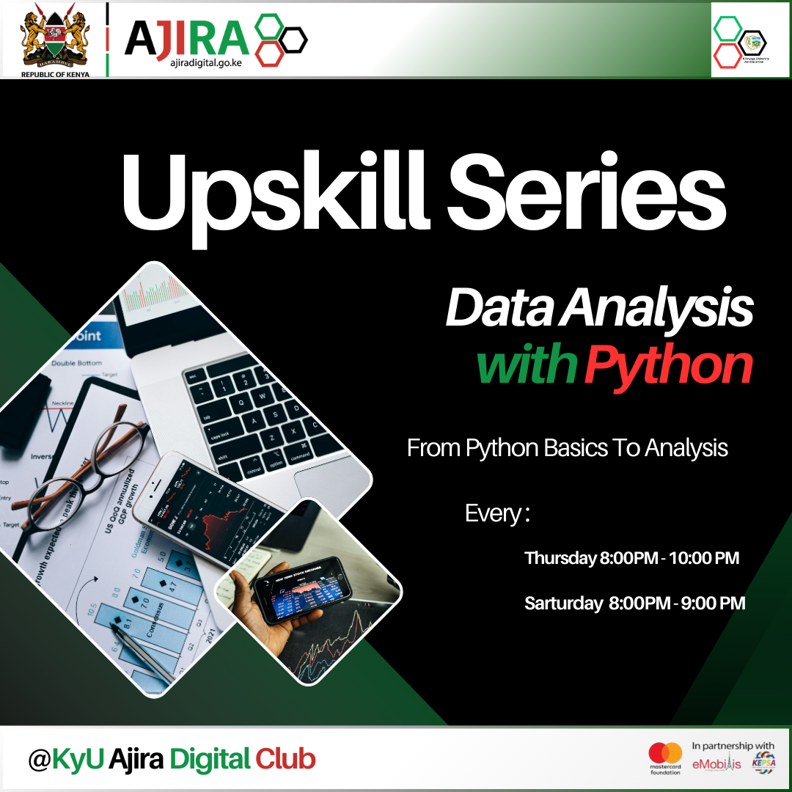

# Upskill Series: Data Analysis with Python



## Table of Contents
1. [Overview](#overview)
2. [Learning Objectives](#learning-objectives)
3. [Prerequisites](#prerequisites)
4. [Setup Instructions](#setup-instructions)
   - [Install Python](#1-install-python)
   - [Install Jupyter Notebook](#2-install-jupyter-notebook-recommended)
   - [Install Required Libraries](#3-install-required-libraries)
   - [Verify Installation](#4-verify-installation)
5. [Roadmap](#roadmap)
6. [Reading Material](#reading-materials)
7. [How to Participate](#how-to-participate)

---

## Overview
The **Ajira Digital Club of Kirinyaga University** presents the **Upskill Series**, an initiative designed to equip members and the wider community with industry-relevant skills. 

The first session in this series focuses on **Data Analysis with Python**, building on previous training in Excel-based data analysis. This hands-on training will guide participants through Python programming fundamentals, data manipulation, and visualization using key libraries like **NumPy, Pandas, Matplotlib, and Seaborn**.

## Learning Objectives
By the end of this training, participants will:
- Understand Python programming basics
- Work with data structures and control flow in Python
- Handle data files and perform basic data cleaning
- Use **NumPy** for numerical computations
- Use **Pandas** for data manipulation
- Create visualizations using **Matplotlib** and **Seaborn**

## Prerequisites
To get the most out of this training, you should:
- Have basic computer literacy
- Be familiar with spreadsheets (Excel/Google Sheets is a plus but not required)
- Have an eagerness to learn Python!

## Setup Instructions
Follow these steps to set up your environment:

### 1. Install Python

**Live Youtube Guide :**

 1.  [Windows ](https://youtu.be/P7Q4_pqj7uc)
 2.  [For Mac OS: ](https://youtu.be/nhv82tvFfkM)
 3.  [For Linux Ubuntu: ](https://youtu.be/IAco2SSuGms)

Download and install the latest version of Python from [python.org](https://www.python.org/downloads/).

### 2. Install Jupyter Notebook (Recommended)
Jupyter Notebook provides an interactive coding environment:
```bash
pip install jupyterlab
```
Run Jupyter Notebook with:
```bash
jupyter lab
```

### 3. Install Required Libraries
Ensure you have the necessary Python libraries installed:
```bash
pip install numpy pandas matplotlib seaborn
```

### 4. Verify Installation
Run the following command in Python to check installations:
```python
import numpy as np
import pandas as pd
import matplotlib.pyplot as plt
import seaborn as sns
print("Setup Successful!")
```
---
## Roadmap

[🚀 View the Data Analysis Roadmap on roadmap.sh](https://roadmap.sh/data-analyst)

Below is the structured roadmap for the training:

```mermaid
graph TD;
    A[Python Basics] -->|Next| B[Variables & Data Types]
    A -->|Next| C[Operators]
    A -->|Next| D[Control Flow - Conditions & Loops]
    A -->|Next| E[Functions & Modules]

    B -->|Next| F[Data Structures]
    F -->|Next| G[Lists & Tuples]
    F -->|Next| H[Dictionaries & Sets]

    D -->|Next| I[Exception Handling]
    E -->|Next| J[File Handling]

    F -->|Next| K[NumPy Basics]
    K -->|Next| L[Arrays & Indexing]
    K -->|Next| M[Math Operations]

    K -->|Next| N[Pandas Basics]
    N -->|Next| O[Series & DataFrames]
    N -->|Next| P[Data Cleaning & Manipulation]

    N -->|Next| Q[Data Visualization]
    Q -->|Next| R[Matplotlib Basics]
    Q -->|Next| S[Seaborn Basics]
    Q -->|Next| T[Advanced Plots - Histograms & Heatmaps]

    T -->|Bonus| U[Regular Expressions]
    T -->|Bonus| V[Datetime Handling]

    %% Styling
    classDef primary fill:#3498db,stroke:#2980b9,stroke-width:2px,color:#ffffff;
    classDef secondary fill:#27ae60,stroke:#1e8449,stroke-width:2px,color:#ffffff;
    classDef highlight fill:#f1c40f,stroke:#f39c12,stroke-width:2px,color:#000000;

    class A,B,C primary;
    class D,E,F,G,H,I,J secondary;
    class K,L,M,N,O,P,Q,R,S,T,U,V highlight;
```
---

## Reading Materials
To help you learn Python and Data Analysis more effectively, here are some useful resources:

### Python Basics
- [Python Official Documentation](https://docs.python.org/3/)
- [W3Schools Python Tutorial](https://www.w3schools.com/python/)
- [Real Python - Beginner Tutorials](https://realpython.com/python-beginners-guide/)
- [Learn Python - FreeCodeCamp](https://www.freecodecamp.org/news/learn-python-free-python-courses-for-beginners/)

### Python for Data Analysis
- [Pandas Documentation](https://pandas.pydata.org/docs/)
- [NumPy Documentation](https://numpy.org/doc/)
- [Matplotlib Documentation](https://matplotlib.org/stable/contents.html)
- [Seaborn Documentation](https://seaborn.pydata.org/)
- [Data Science Handbook - Jake VanderPlas](https://jakevdp.github.io/PythonDataScienceHandbook/)
- [DataCamp - Python for Data Analysis](https://www.datacamp.com/courses/intro-to-python-for-data-science)
- [Kaggle - Learn Python](https://www.kaggle.com/learn/python)
## How to Participate
- Join our live sessions.
- Follow along with provided notebooks and exercises
- Engage with the community, ask questions, and collaborate!

---
**Let’s upskill together! 🚀**


